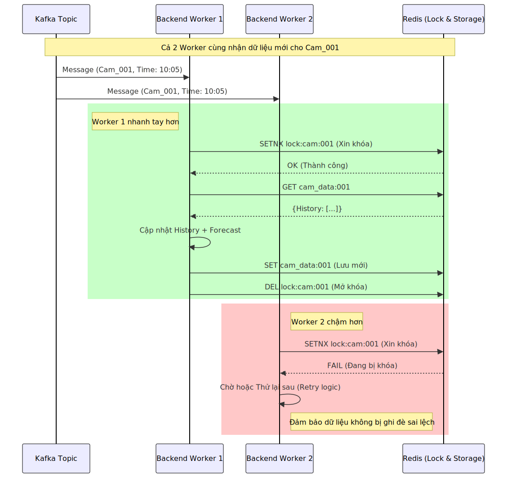

# Intelligent Traffic Monitoring System
## 1. Thành viên nhóm
- Nguyễn Văn Lâm Hùng
- Phan Anh 2351260639
- Lê Sỹ Long Nhật
- Vũ Trí Trường - 2351260692

## 2. Giải thích kiến trúc


### 2.1. Cơ chế Lưu trữ Phân tán & Scalability của Kafka
  
Thay vì dồn dữ liệu vào một hàng đợi duy nhất, Kafka chia dữ liệu thành các **Partitions**.

* **Tại sao quan trọng?** Nếu bạn có 1000 cameras, một Consumer đơn lẻ sẽ không xử lý kịp. Kafka cho phép chia 1000 cameras này thành 4 (hoặc n) nhóm, mỗi nhóm được một Spark Worker xử lý riêng biệt.


---

### 2.2. Luồng Xử lý "Micro-batch" trong Spark A(Job 1)

Biểu đồ này mô tả chi tiết những gì diễn ra bên trong file `traffic_monitor.py`. Spark Streaming không xử lý từng ảnh một (rất chậm), mà nó gom ảnh thành các "lô nhỏ" (Micro-batch) rồi mới gửi vào hàm `mapInPandas`.

* **Singleton Pattern:** Lưu ý phần "Load Model (1 lần)". Code của bạn dùng `threading.Lock` để đảm bảo model chỉ được load 1 lần khi Worker khởi động, tránh việc load lại model với mỗi lô ảnh (gây tràn RAM).
---

### 2.3. Cơ chế Khóa Phân Tán (Distributed Locking) trong Backend


Sử dụng Redis để ngăn chặn xung đột dữ liệu (Race Condition).

* **Vấn đề:** Vì `backend.py` chạy bất đồng bộ (Async) và có thể scale lên nhiều instance, có khả năng 2 luồng cùng nhận được dữ liệu update cho `cam_001` cùng lúc.
* **Giải pháp:** Sử dụng `redis_client.lock("lock:cam:cam_001")`
---

### Tổng kết

1. **Scale chiều ngang (Horizontal Scaling):** Nhờ Kafka Partitioning.
2. **Tối ưu tính toán (Computation Optimization):** Nhờ Spark Micro-batch & Singleton Model.
3. **Toàn vẹn dữ liệu (Data Consistency):** Nhờ Redis Distributed Lock.
Hệ thống giám sát giao thông thông minh sử dụng Big Data (Spark, Kafka, Redis) và Deep Learning (YOLO).


## 3. Yêu cầu hệ thống
- **Hệ điều hành:** Ubuntu 24.04+ (hoặc các bản phân phối Linux tương đương)
- **Java:** JDK 21
- **Spark:** 4.1.0
- **Kafka:** 4.1.1 (KRaft mode)
- **Redis**: 8.4.0
- **Python Manager:** uv

---

## 4. Cài đặt môi trường

### 4.1. Cài đặt Java, Spark và Kafka
Chạy các lệnh sau để cài đặt các thành phần nền tảng vào thư mục `/opt`.

```bash
# Cập nhật hệ thống
sudo apt update && sudo apt upgrade -y
sudo apt install wget curl -y

# 1. Cài đặt Java 21 (LTS)
sudo apt install openjdk-21-jdk -y

# 2. Cài đặt Apache Spark 4.1.0
cd /opt
sudo wget https://dlcdn.apache.org/spark/spark-4.1.0/spark-4.1.0-bin-hadoop3.tgz
sudo tar xvf spark-4.1.0-bin-hadoop3.tgz
sudo mv spark-4.1.0-bin-hadoop3 spark
sudo rm spark-4.1.0-bin-hadoop3.tgz

# 3. Cài đặt Apache Kafka 4.1.1 (KRaft Mode)
sudo wget https://dlcdn.apache.org/kafka/4.1.1/kafka_2.13-4.1.1.tgz
sudo tar xfv kafka_2.13-4.1.1.tgz
sudo mv kafka_2.13-4.1.1 kafka
sudo rm kafka_2.13-4.1.1.tgz

# Cấp quyền sở hữu thư mục cho người dùng hiện tại
sudo chown -R $USER:$USER /opt/spark /opt/kafka

# Cài đặt Redis
sudo apt-get install lsb-release curl gpg
curl -fsSL https://packages.redis.io/gpg | sudo gpg --dearmor -o /usr/share/keyrings/redis-archive-keyring.gpg
sudo chmod 644 /usr/share/keyrings/redis-archive-keyring.gpg
echo "deb [signed-by=/usr/share/keyrings/redis-archive-keyring.gpg] https://packages.redis.io/deb $(lsb_release -cs) main" | sudo tee /etc/apt/sources.list.d/redis.list
sudo apt-get update
sudo apt-get install redis
sudo apt-get install lsb-release curl gpg
curl -fsSL https://packages.redis.io/gpg | sudo gpg --dearmor -o /usr/share/keyrings/redis-archive-keyring.gpg
sudo chmod 644 /usr/share/keyrings/redis-archive-keyring.gpg
echo "deb [signed-by=/usr/share/keyrings/redis-archive-keyring.gpg] https://packages.redis.io/deb $(lsb_release -cs) main" | sudo tee /etc/apt/sources.list.d/redis.list
sudo apt-get update
sudo apt-get install redis
```

### 4.2. Cấu hình Biến môi trường
Thêm cấu hình vào file `~/.bashrc` để có thể sử dụng các lệnh ở bất cứ đâu:

```bash
echo 'export JAVA_HOME=/usr/lib/jvm/java-21-openjdk-amd64' >> ~/.bashrc
echo 'export SPARK_HOME=/opt/spark' >> ~/.bashrc
echo 'export KAFKA_HOME=/opt/kafka' >> ~/.bashrc
echo 'export PATH=$PATH:$JAVA_HOME/bin:$SPARK_HOME/bin:$SPARK_HOME/sbin:$KAFKA_HOME/bin' >> ~/.bashrc
source ~/.bashrc
```

### 4.3. Cài đặt Python và thư viện (sử dụng `uv`)
Dự án sử dụng `uv` để quản lý thư viện nhanh hơn.

```bash
# Cài đặt uv
curl -LsSf https://astral.sh/uv/install.sh | sh
source $HOME/.cargo/env
source ~/.bashrc

# Khởi tạo môi trường và cài đặt thư viện
uv venv
uv sync
```

---

## 5. Cấu hình và Khởi chạy Kafka

Kafka 4.x sử dụng KRaft thay thế cho Zookeeper.

### 5.1. Cấu hình ban đầu
```bash
# 1. Tạo Cluster ID và định dạng ổ đĩa
KAFKA_CLUSTER_ID="$(kafka-storage.sh random-uuid)"
kafka-storage.sh format -t $KAFKA_CLUSTER_ID -c /opt/kafka/config/server.properties

# 2. Cấu hình giới hạn dung lượng message (> 10 MB cho dữ liệu hình ảnh YOLO)
echo "message.max.bytes=10485760" >> /opt/kafka/config/server.properties
echo "replica.fetch.max.bytes=10485760" >> /opt/kafka/config/server.properties
```

### 5.2. Khởi động Server và Tạo Topic
```bash
# Chạy Kafka Server (Chế độ chạy ngầm - daemon)
kafka-server-start.sh -daemon /opt/kafka/config/server.properties

# Tạo topic cho dữ liệu YOLO
kafka-topics.sh --create --topic traffic-volume --bootstrap-server localhost:9092
kafka-topics.sh --create --topic traffic-raw --bootstrap-server localhost:9092
kafka-topics.sh --create --topic traffic-aggregated --bootstrap-server localhost:9092
kafka-topics.sh --create --topic traffic-forecast --bootstrap-server localhost:9092
```
Chú ý mỗi lần khởi động lại máy tính thì phải khởi động lại Kafka server
```bash
kafka-server-start.sh -daemon /opt/kafka/config/server.properties
```
## 6. Hướng dẫn chạy cả dự án (tất cả chạy tại thư mục intelligent_traffic_monitoring_system)
### Chạy với 3 terminal song song cho kafka và spark
```bash
spark-submit --packages org.apache.spark:spark-sql-kafka-0-10_2.13:4.1.0 spark/traffic_monitor.py
```
```bash
spark-submit --packages org.apache.spark:spark-sql-kafka-0-10_2.13:4.1.0 spark/traffic_aggregated.py
```
```bash
spark-submit --packages org.apache.spark:spark-sql-kafka-0-10_2.13:4.1.0 spark/traffic_forecast.py 
```
### Chạy 2 camera gửi dữ liệu song song
```bash
python kafka/producer.py --idx 0
```

```bash
python kafka/producer.py --idx 1
```
### Hiển thị website Giám sát
```bash
fastapi run web/main.py # truy cập tại http://localhost:8000/
```

## 7. Quy trình làm việc với Git

### Cài đặt khuyến nghị
- Cài đặt extension **Ruff** trên VSCode để tự động format code chuẩn.

### Các lệnh Git cơ bản
1. **Clone dự án:**
   ```bash
   git clone https://github.com/Lam-Hung-ai/intelligent_traffic_monitoring_system.git
   ```

2. **Tạo nhánh mới để làm việc:**
   ```bash
   git branch ten_cua_ban      # Tạo nhánh mới
   git checkout ten_cua_ban    # Chuyển sang nhánh đó
   ```

3. **Cập nhật code lên Github:**
   ```bash
   git add .
   git commit -m "mô tả thay đổi"
   git push -u origin ten_cua_ban
   ```

4. **Đồng bộ code mới nhất từ main:**
   ```bash
   git pull --no-rebase
   ```
